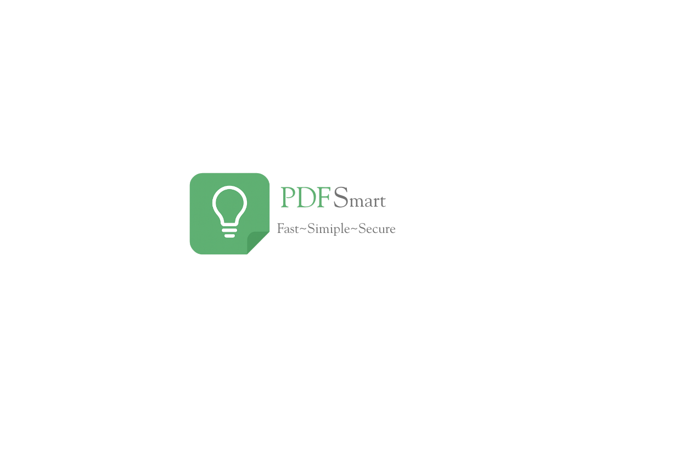

# PDFSmart

A modern, feature-rich PDF editor built with WPF and .NET 8, featuring a MaterialDesign UI with OCR, visual page splicing, and click-to-place text editing.



## Features

- **PDF Viewing** — WebView2-powered inline document preview
- **Click-to-Place Text Editing** — Click anywhere on the PDF preview to add formatted text with live positioning
- **Form Filling** — Detect and fill interactive PDF form fields
- **Visual Page Splicing** — Drag-and-drop style page assembly from multiple PDF files with thumbnail previews
- **OCR / Make Searchable** — Tesseract-powered OCR converts scanned/image PDFs into searchable text
- **Export to Images** — Render every page as high-DPI PNG, JPEG, BMP, or TIFF
- **Page Manipulation** — Combine, split, extract ranges, and remove individual pages
- **Copy All Text** — One-click full-text extraction to clipboard
- **Smart Extract** — Paragraph-level text block extraction with individual editing
- **XFA/Dynamic Form Safety** — Auto-detects Adobe-only PDFs and offers to open them externally
- **Crash Logging** — Automatic error reports saved to `Documents\PDFSmart\crash.log`

## Installation

### Option 1: Installer (Recommended)

1. Download `PDFSmart_Setup_v1.0.0.exe` from the [Releases](../../releases) page
2. Run the installer — it will place the app in `Program Files\PDFSmart`
3. A Desktop shortcut is created automatically

### Option 2: Build from Source

**Prerequisites:**
- .NET 8.0 SDK
- Visual Studio 2022 or VS Code

```bash
# Clone the repository
git clone <repository-url>
cd PDFSmart

# Build the project
dotnet build PDFSmart\PDFSmart.csproj --configuration Release

# Run the application
dotnet run --project PDFSmart\PDFSmart.csproj
```

## Publishing

To create a distributable build:

### Using PowerShell

```powershell
.\publish.ps1
```

### Using Batch

```bash
publish.bat
```

### Manual Publish

```bash
dotnet publish PDFSmart\PDFSmart.csproj ^
  --configuration Release ^
  --runtime win-x64 ^
  --self-contained true ^
  --output publish
```

The application and all dependencies will be in the `publish\` folder.

### Building the Installer

Requires [Inno Setup 6](https://jrsoftware.org/isinfo.php):

```powershell
& "$env:LocalAppData\Programs\Inno Setup 6\iscc.exe" installer.iss
```

Output: `Output\PDFSmart_Setup_v1.0.0.exe`

## Requirements

- Windows 10/11 (64-bit)
- .NET 8.0 Runtime (included in self-contained builds)

## Technology Stack

| Component | Technology |
|---|---|
| Framework | .NET 8.0 WPF |
| PDF Manipulation | PdfSharp 6.2.4 |
| PDF Rendering | PdfiumViewer + pdfium native |
| OCR Engine | Tesseract 5.2.0 |
| UI Theme | MaterialDesignThemes 5.3.0 |
| Viewer | Microsoft WebView2 |
| MVVM | CommunityToolkit.Mvvm 8.4.0 |
| Installer | Inno Setup 6 |

## Project Structure

```
PDFSmart/
├── PDFSmart/
│   ├── Assets/           # Icons and images
│   ├── Converters/       # WPF value converters
│   ├── Models/           # Data models (TextAnnotation, FormField, etc.)
│   ├── Services/         # PDF service layer (IPdfService, PdfSharpService)
│   ├── ViewModels/       # MVVM view models
│   ├── Views/            # XAML dialogs (TextEditing, FormFilling, VisualSplicing)
│   ├── tessdata/         # Tesseract OCR language data
│   ├── App.xaml          # Theme + resources + crash handler
│   └── MainWindow.xaml   # Main application window
├── SmartPdfEditor.Tests/ # Unit and smoke tests
├── installer.iss         # Inno Setup installer script
├── publish.bat           # Publish script (Batch)
├── publish.ps1           # Publish script (PowerShell)
└── SmartPdfEditor.sln    # Solution file
```

## Usage

1. **Open PDF** — Click the folder icon or use File → Open
2. **Add Text** — Click "Add Text", then click directly on the PDF preview to position your text
3. **Fill Forms** — Open a PDF with form fields, click "Fill Form", enter values and save
4. **Visual Splicing** — Click "Visual Splicing" to load multiple PDFs and assemble pages visually
5. **Make Searchable** — Open a scanned PDF, click "Make Searchable" to run OCR
6. **Export Images** — Extract all pages as high-resolution image files
7. **Combine / Split / Extract / Remove** — Standard page manipulation tools

## Version History

### v1.0.0

- PDF viewing, text editing with click-to-place, form filling
- Visual page splicing with drag-and-drop thumbnails
- OCR (Make Searchable) with Tesseract integration
- Export pages to images (PNG, JPEG, BMP, TIFF)
- Page operations (combine, split, extract, remove)
- XFA/Dynamic form detection and safety handling
- Professional installer via Inno Setup
- Automatic crash logging

## License

MIT License — See [LICENSE](LICENSE) for details.

## Support

For issues or questions, please [open an issue](../../issues) on GitHub.

---

**PDFSmart** — Making PDF editing simple and modern.
